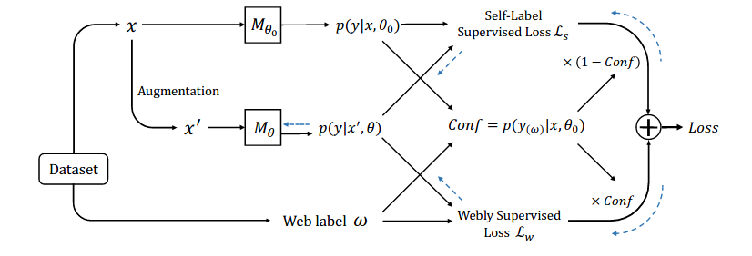

## Webly Supervised Image Classification with Self-Contained Confidence

[Webly Supervised Image Classification with
Self-Contained Confidence](https://arxiv.org/abs/2008.11894).

**Jingkang Yang, Litong Feng, Weirong Chen, Xiaopeng Yan, Huabin Zheng, Ping Luo, Wayne Zhang**

SenseTime Research, SenseTime.

### Overview of WSL
We introduce Self-Contained Confidence (SCC) by adapting model uncertainty for WSL setting, and use it to sample-wisely balance the self-label supervised loss and the webly supervised loss. Therefore, a simple yet effective WSL framework is proposed.

The paper has been accepted by ECCV 2020. For more details, please refer to our [paper](https://arxiv.org/abs/2008.11894).

<p align="left">

</p>

## Getting started
#### Requirements

To install requirements:

```setup
pip install -r requirements.txt
```

### Preparation

Put this git repository in a root directory. And in the root directory, run

```train
mkdir checkpoint
mkdir data
mkdir imglists
```

The experiments used Food101 and WebVision datasets.

You can download the image list files in the imglists folder for reading datasets here:

- [Image Lists](https://drive.google.com/file/d/1eg5alvrQh8Fvf48mfbR4QM0AUqiBNleX/view?usp=sharing)


### Training and Evaluation

To run the baseline in the paper, run this command:

```train
sh ./scripts/WSL/food101n/base.sh
```
To run the SCC in the paper, run this command:

```train
sh ./scripts/WSL/food101n/offline_scc.sh
```

### Pre-trained Models

You can download pretrained models here:

- [Trained models](https://drive.google.com/file/d/17w2aIyIc79_oyzeexh6vrmG6v3G-XDWT/view?usp=sharing)

### Results

Our model achieves the following performance on Food101N dataset:

| Model name         | Top 1 Accuracy  | Top 5 Accuracy |
| ------------------ |---------------- | -------------- |
| baseline               |     83.66%         |      94.97%       |
| offline scc   |     86.44%         |      96.77%       |

Our model achieves the following performance on Google500 dataset:

| Model name         | Top 1 Accuracy  | Top 5 Accuracy |
| ------------------ |---------------- | -------------- |
| baseline               |     68.31%         |      82.12%       |
| offline scc   |     69.16%         |      82.66%       |


### License

```
Copyright (c) 2019-present SenseTime Research.

Permission is hereby granted, free of charge, to any person obtaining a copy
of this software and associated documentation files (the "Software"), to deal
in the Software without restriction, including without limitation the rights
to use, copy, modify, merge, publish, distribute, sublicense, and/or sell
copies of the Software, and to permit persons to whom the Software is
furnished to do so, subject to the following conditions:

The above copyright notice and this permission notice shall be included in
all copies or substantial portions of the Software.

THE SOFTWARE IS PROVIDED "AS IS", WITHOUT WARRANTY OF ANY KIND, EXPRESS OR
IMPLIED, INCLUDING BUT NOT LIMITED TO THE WARRANTIES OF MERCHANTABILITY,
FITNESS FOR A PARTICULAR PURPOSE AND NONINFRINGEMENT.  IN NO EVENT SHALL THE
AUTHORS OR COPYRIGHT HOLDERS BE LIABLE FOR ANY CLAIM, DAMAGES OR OTHER
LIABILITY, WHETHER IN AN ACTION OF CONTRACT, TORT OR OTHERWISE, ARISING FROM,
OUT OF OR IN CONNECTION WITH THE SOFTWARE OR THE USE OR OTHER DEALINGS IN
THE SOFTWARE.
```

### References
If you find our code useful，please cite papers:

[Webly Supervised Image Classification with
Self-Contained Confidence](https://arxiv.org/abs/2008.11894)

Learning Image Classifier from Only Web Labels and Metadata: Automatic Label Correction through Graph (ACM-MM Oral Presentation), 2020


